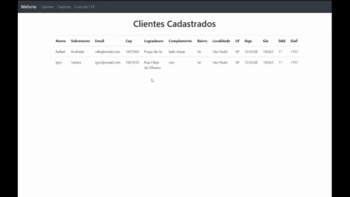

# Cadastro de Clientes

### Este projeto foi construído com FLask, API, Bootstrap

Utilizando API : https://viacep.com.br/

A sacada deste projeto não é apenas cadastrar clientes, é adicionar o endereço do mesmo assim automaticamente
assim que o campo de CEP é preenchido. Outro ponto interessante é dar ao cliente a possibilidade de buscar os 
dados de endereço através da página de busca.

<h1 align="center">
  
</h1>

CONCLUSÃO :
Projeto de estudo voltado para treinar habilidades de desenvolvimento back-end, flask, consulta api e web.

Faça uso deste projeto para consultar, dar sugestões e dicas para melhorar o código.
